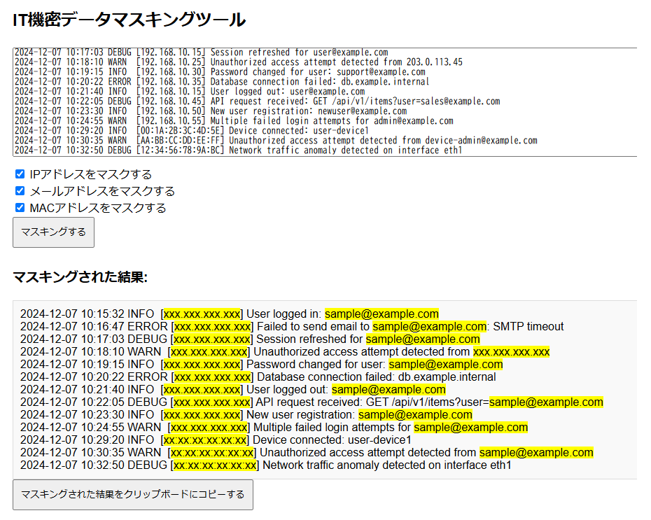

# IT機密データマスキングツール

## 概要
IT機密データマスキングツールは、テキスト内に含まれる機密情報（IPアドレス、メールアドレス、MACアドレス）を簡単にマスキングするためのブラウザベースのツールです。ユーザーはテキストを入力し、特定の情報をマスキングすることで、プライバシーを保護することができます。

## 使用方法

1. **入力**
   - テキストエリアにマスキングしたい内容を入力するか、クリップボードから貼り付けてください。

2. **マスキングする情報を選択**
   - マスキングしたい情報の種類（IPアドレス、メールアドレス、MACアドレス）を選択します。各オプションにチェックを入れることで、その情報がマスキング対象になります。

3. **マスキングの実行**
   - 「マスキングする」ボタンを押して、選択された情報をマスキングします。結果はテキストエリアの下に表示されます。

4. **結果のコピー**
   - 「マスキングされた結果をクリップボードにコピーする」ボタンを押すと、マスキングされた結果がクリップボードにコピーされます。コピーした内容は別のドキュメントやメールに貼り付けることができます。

## URL

https://kichouji.github.io/privacy-text-masker/

## 注意事項
- ブラウザのJavaScript機能を利用しており、外部にデータを送信することはありません。安心してご利用ください。

## 免責事項
本ツールは、プライバシー保護のために利用できますが、完全なセキュリティを保証するものではありません。重要な情報の取り扱いには十分にご注意ください。

